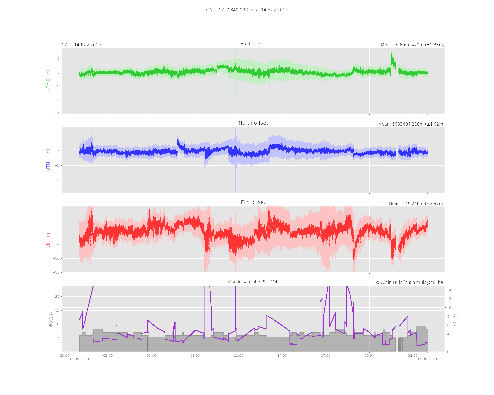
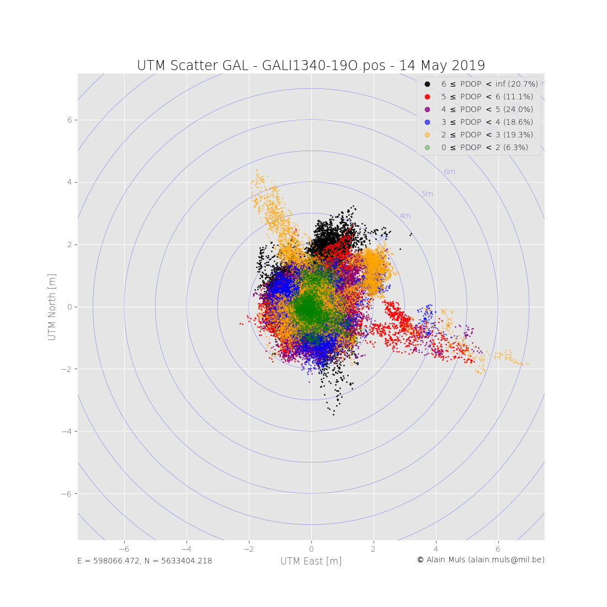
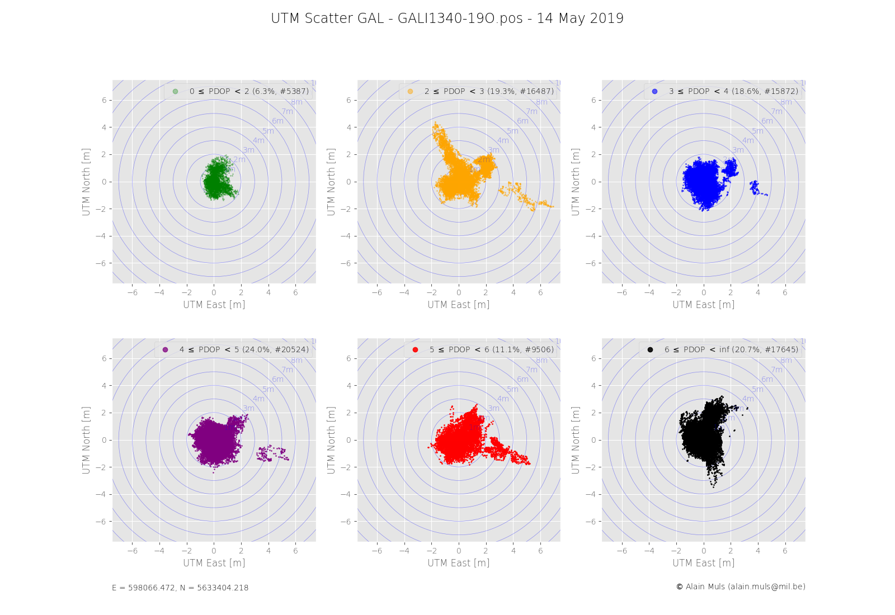
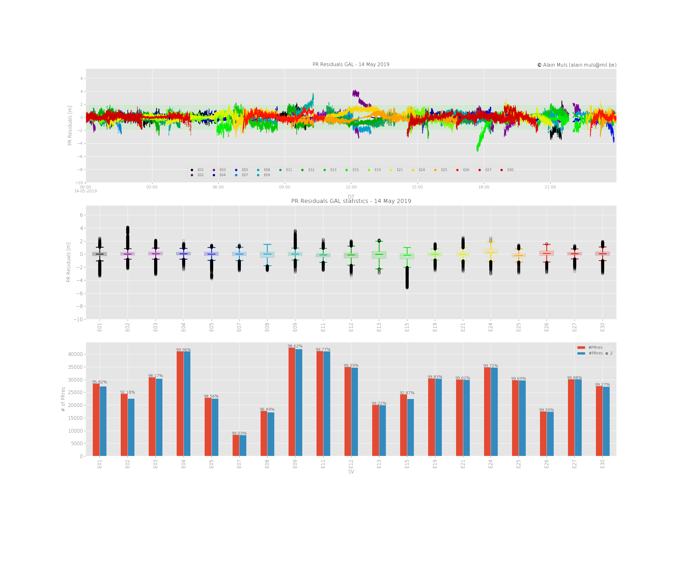
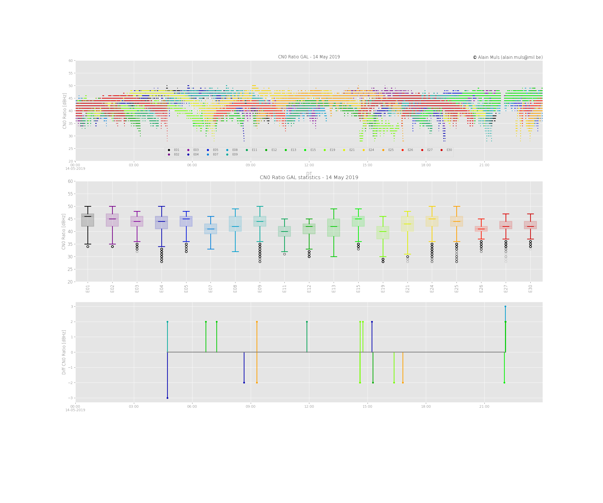
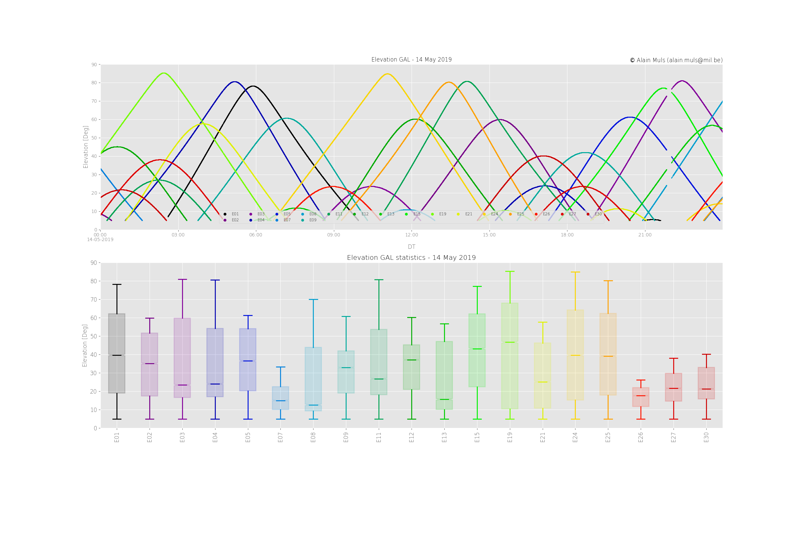

# `pyRTKLib` repository

## Introduction

The `pyRTKLib` repository processes `RINEX` observation / navigation files for Galileo, GPS or a combination of both, using the open source [`RTKLib`](http://www.rtklib.com/) library. It generates plots for:

- `UTM` and height coordinates versus time,
- `UTM` scatter plot,
- pseudo-range residuals plot,
- Carrier-to-Noise `CN0` plot,
- satellite elevation plot, and
- receiver clock plot.

The repository is based on the following directory structure[^1] for the binary receiver data:

\scriptsize 

```bash
${HOME}/RxTURP
    BEGPIOS
        ASTX
            ...
            19133
            19134
            19135
            ...
        BEGP
            ...
            19133
            19134
            19135
            ...
        uBlox
            ...
            19133
            19134
            19135
            ...
```

\normalsize

where `YYDDD` represents 2 digits for the year and 3 digits for the day of year.

During processing, in each receiver type directory (`ASTX`, `BEGP`, ...) a `rinex` directory is created with sub-directories with the same `YYDDD` as the original raw binary data sub-directories.

[^1]: I never tested this repository using another directory structure.

## Processing steps

Processing is split up in 5 steps:

- __`pySBFDaily.py`__
    + receivers from Septentrio log data in the binary `SBF` format. These data are logged in (six-)hourly files and are first combined to a daily `SBF` file. The naming follows the IGS convention for `RINEX` v2.x files. The (daily) combined file is stored in the raw binary data directory.
- __`pyconvbin.py`__
    + converts the binary (daily) `SBF` or `u-Blox` file to `RINEX` observation and navigation files.
- __`pyftposnav.py`__
    + downloads the `RINEX` navigation file for all GNSS systems for a specific date. This creates a directory `igs` on the same level as the `ASTX` directory, in which the sub-directories `YYDOY` are created.
- __`pyrtkproc.py`__
    + based on a common template, ensuring similar processing for all GNSSs, the `RINEX` observation and navigation files are processed using `rnx2rtkp` program from the `RTKLib` library. Two output files are created in a `rtkp`/`GNSS` subdirectory:
        * `<file-name>.pos` containing date-time, position and (co-)variance information. The processing mode and number of satellites used are also reported,
        * `<file-name>.pos.stat` containing various information about the satellites, the pseudo-range residuals, receiver clock and velocity.
- __`pyrtkplot.sh`__
    + using the `<file-name>.pos` and `<file-name>.pos.stat` files, plots are created.

Each script uses pythons logging facility and creates in the directory from which it is called a `<script-name>.log` file which can be used for later inspection. The default logging levels are:

- for the console:  `LOGGING.INFO`
- for the log-file:  `LOGGING.DEBUG`

##  __`pySBFDaily.py`__

### Getting help

\scriptsize 

```bash
$ pySBFDaily.py --help
usage: pySBFDaily.py [-h] [-d DIR] [-o]
                     [-l {CRITICAL,ERROR,WARNING,INFO,DEBUG,NOTSET} {CRITICAL,ERROR,WARNING,INFO,DEBUG,NOTSET}]

pySBFDaily.py creates a daily SBF file based on (six) hourly SBF files found
in given directory

optional arguments:
  -h, --help            show this help message and exit
  -d DIR, --dir DIR     Directory of SBF file (defaults to .)
  -o, --overwrite       overwrite daily SBF file (default False)
  -l {CRITICAL,ERROR,WARNING,INFO,DEBUG,NOTSET} {CRITICAL,ERROR,WARNING,INFO,DEBUG,NOTSET}, --logging {CRITICAL,ERROR,WARNING,INFO,DEBUG,NOTSET} {CRITICAL,ERROR,WARNING,INFO,DEBUG,NOTSET}
                        specify logging level console/file (default INFO
                        DEBUG)
```

\normalsize

### Processing example

\scriptsize 

```bash
$ pySBFDaily.py --dir ~/RxTURP/BEGPIOS/ASTX/19134 -o -l INFO DEBUG
INFO: pySBFDaily.py - main: working diretory is /home/amuls/RxTURP/BEGPIOS/ASTX/19134
INFO: pySBFDaily.py - main: changed to directory /home/amuls/RxTURP/BEGPIOS/ASTX/19134
INFO: pySBFDaily.py - main: combine SBF (six-)hourly files to daily SBF file
INFO: pySBFDaily.py - main: creating daily SBF file SEPT1340.19_
```

\normalsize

yields the following raw binary data directory:

\scriptsize 

```bash
$ ll /home/amuls/RxTURP/BEGPIOS/ASTX/19134 -rt
total 853200
-rw-rw-r-- 1 amuls amuls 100144280 May 14 08:02 SEPT1341.19_
-rw-rw-r-- 1 amuls amuls  11580873 May 14 08:02 SEPT1341.191
-rw-rw-r-- 1 amuls amuls 102000168 May 14 14:02 SEPT1342.19_
-rw-rw-r-- 1 amuls amuls  11645676 May 14 14:02 SEPT1342.191
-rw-rw-r-- 1 amuls amuls 101275596 May 14 20:02 SEPT1343.19_
-rw-rw-r-- 1 amuls amuls  11705476 May 14 20:02 SEPT1343.191
-rw-rw-r-- 1 amuls amuls  12423431 May 15 02:02 SEPT1344.191
-rw-rw-r-- 1 amuls amuls 109727776 May 15 02:02 SEPT1344.19_
-rw-r--r-- 1 amuls amuls 413147820 Oct 28 14:53 SEPT1340.19_
```

\normalsize

##  __`pyconvbin.py`__

'pyconvbin.py' is based on several programs to convert binary (proprietary) formats to `RINEX`: 

- `sbf2rin` for converting binary `SBF` data to `RINEX v3.x` format,
- `convbin` for converting binary `u-Blox` data to `RINEX v3.x` format,
- the open source program `gfzrnx`[^4] used for checking the `RINEX` files and for separating according to the data of satellite systems

Using the proprietary conversion programs temporary `RINEX` observation and navigation files are created. The observation header information is extracted yielding:

- storing the header information in a `json` structure
- a report similar to the console

From this header information, the `pyconvbin.py` determines the date of data collection, used for creating the `RINEX` files for the satellite systems from the global temporary `RINEX` files:

- __Galileo__ ('E'), marker name `GALI` for open source navigation services, marker name `GPRS` when PRS is detected,
- __GPS__ ('G'), marker name `GPSN`,
- if possible, __Combined EG__ ('M') marker name `COMB`

During the final `RINEX` files creation, the above mentioned marker names replace the original marker name and the approximate coordinates, marker name and number and observer/agency header lines are replaced.[^3]

\tiny

```
INFO: gfzrnx_ops.py - rnxobs_header_info: extracting RINEX observation header
INFO: amutils.py - run_subprocess: running /home/amuls/bin/gfzrnx -finp /tmp/COMBdoyS.yyO -meta basic:json -fout /tmp/COMBdoyS.yyO.json -f
INFO: gfzrnx_ops.py - rnxobs_header_info: RINEX observation basic information
INFO: gfzrnx_ops.py - rnxobs_header_info:    marker: TURX
INFO: gfzrnx_ops.py - rnxobs_header_info:    times:
INFO: gfzrnx_ops.py - rnxobs_header_info:          first: 2019 01 11 00 00 00.0000000
INFO: gfzrnx_ops.py - rnxobs_header_info:           last: 2019 01 11 23 59 59.0000000
INFO: gfzrnx_ops.py - rnxobs_header_info:       interval: 1.00
INFO: gfzrnx_ops.py - rnxobs_header_info:         DOY/YY: 011/19
INFO: gfzrnx_ops.py - rnxobs_header_info:    satellite system: E (Galileo)
INFO: gfzrnx_ops.py - rnxobs_header_info:        frequencies: ['1', '6']
INFO: gfzrnx_ops.py - rnxobs_header_info:       system types: ['C', 'D', 'L', 'S']
INFO: gfzrnx_ops.py - rnxobs_header_info:        observables: ['C1A', 'C6A', 'D1A', 'D6A', 'L1A', 'L6A', 'S1A', 'S6A']
```

\normalsize

The `RINEX` files are stored in the corresponding directories explained above. 

A observation statistics file is created in the sub-directory `gfzrnx\MARKER`. These files report for each satellite the number of observables in the `RINEX` observation file in tabular format. 

Example:

\scriptsize

```bash
$ cat /home/amuls/RxTURP/BEGPIOS/ASTX/rinex/19134/gfzrnx/GALI/GALI1340-19O.obsstat 
STP GALI E TYP   C1C   C5Q   D1C   D5Q   L1C   L5Q   S1C   S5Q
STO GALI E E01 34685 34837 34685 34837 34685 34837 34685 34837
STO GALI E E02 27443 27459 27443 27459 27443 27459 27443 27459
STO GALI E E03 33499 33550 33499 33550 33499 33550 33499 33550
STO GALI E E04 42628 42671 42628 42671 42628 42671 42628 42671
STO GALI E E05 45416 45416 45416 45416 45416 45416 45416 45416
STO GALI E E07 16376 16566 16376 16566 16376 16566 16376 16566
STO GALI E E08 22419 22430 22419 22430 22419 22430 22419 22430
STO GALI E E09 46114 46215 46114 46215 46114 46215 46114 46215
STO GALI E E11 43915 44002 43915 44002 43915 44002 43915 44002
STO GALI E E12 36791 36861 36791 36861 36791 36861 36791 36861
STO GALI E E13 24574 24647 24574 24647 24574 24647 24574 24647
STO GALI E E14 24527 24716 24527 24716 24527 24716 24527 24716
STO GALI E E15 30125 30133 30125 30133 30125 30133 30125 30133
STO GALI E E18 27383 27418 27383 27418 27383 27418 27383 27418
STO GALI E E19 33384 33887 33384 33887 33384 33887 33384 33887
STO GALI E E20 16425     0 16425     0 16425     0 16425     0
STO GALI E E21 33893 33933 33893 33933 33893 33933 33893 33933
STO GALI E E22 39056 39425 39056 39425 39056 39425 39056 39425
STO GALI E E24 37383 37418 37383 37418 37383 37418 37383 37418
STO GALI E E25 31310 31563 31310 31563 31310 31563 31310 31563
STO GALI E E26 21440 21322 21440 21322 21440 21322 21440 21322
STO GALI E E27 32958 33110 32958 33110 32958 33110 32958 33110
STO GALI E E30 30260 30266 30260 30266 30260 30266 30260 30266
```

### Getting help

\scriptsize 

```bash
$ pyconvbin.py --help
usage: pyconvbin.py [-h] [-d DIR] -f FILE [-b {SBF,UBX}] [-r RINEXDIR]
                    [-c CART CART CART] [-o] [-l LOGGING LOGGING]

pyconvbin.py convert binary raw data from SBF or UBlox to RINEX Obs & Nav
files

optional arguments:
  -h, --help            show this help message and exit
  -d DIR, --dir DIR     Root directory (default .)
  -f FILE, --file FILE  Binary SBF or UBlox file
  -b {SBF,UBX}, --binary {SBF,UBX}
                        Select binary format (default SBF)
  -r RINEXDIR, --rinexdir RINEXDIR
                        Directory for RINEX output (default .)
  -c CART CART CART, --cart CART CART CART
                        cartesian coordinates of antenna (default RMA)
  -o, --overwrite       overwrite intermediate files (default False)
  -l LOGGING LOGGING, --logging LOGGING LOGGING
                        specify logging level console/file (default INFO
                        DEBUG)
```

\normalsize

### Processing example

\tiny 

```bash
$ pyconvbin.py -d ~/RxTURP/BEGPIOS/ASTX/19134/ -f SEPT1340.19_ -b SBF -r ~/RxTURP/BEGPIOS/ASTX/rinex/19134/

INFO: pyconvbin.py - main: arguments processed: amc.dRTK = {'rootDir': '/home/amuls/RxTURP/BEGPIOS/ASTX/19134/', \
'binFile': 'SEPT1340.19_', 'binType': 'SBF', \
'rinexDir': '/home/amuls/RxTURP/BEGPIOS/ASTX/rinex/19134/', \
'ant_crds': [4023741.3045, 309110.4584, 4922723.1945], \
'gfzrnxDir': '/home/amuls/RxTURP/BEGPIOS/ASTX/rinex/19134/gfzrnx'}
INFO: pyconvbin.py - checkValidityArgs: check existence of rootDir /home/amuls/RxTURP/BEGPIOS/ASTX/19134/
INFO: pyconvbin.py - checkValidityArgs: check existence of binary file /home/amuls/RxTURP/BEGPIOS/ASTX/19134/SEPT1340.19_ to convert
INFO: pyconvbin.py - checkValidityArgs: check existence of rinexdir /home/amuls/RxTURP/BEGPIOS/ASTX/rinex/19134/ and create if needed
INFO: pyconvbin.py - checkValidityArgs: check existence of gfzrnxdir /home/amuls/RxTURP/BEGPIOS/ASTX/rinex/19134/gfzrnx and create if needed
INFO: location.py - locateProg: locate programs convbin
INFO: location.py - locateProg: convbin is /usr/bin/convbin
INFO: location.py - locateProg: locate programs sbf2rin
INFO: location.py - locateProg: sbf2rin is /opt/Septentrio/RxTools/bin/sbf2rin
INFO: location.py - locateProg: locate programs gfzrnx
INFO: location.py - locateProg: gfzrnx is /home/amuls/bin/gfzrnx
INFO: pyconvbin.py - main: convert binary file to rinex
INFO: pyconvbin.py - sbf2rinex: RINEX conversion from SBF binary
INFO: pyconvbin.py - sbf2rinex: creating RINEX observation file
INFO: amutils.py - run_subprocess: running /opt/Septentrio/RxTools/bin/sbf2rin -f /home/amuls/RxTURP/BEGPIOS/ASTX/19134/SEPT1340.19_ -x RSCJI -s -D -v -R3 -o /tmp/COMBdoyS.yyO

Creating RINEX file: done                                                       
INFO: pyconvbin.py - sbf2rinex: creating RINEX navigation file
INFO: amutils.py - run_subprocess: running /opt/Septentrio/RxTools/bin/sbf2rin -f /home/amuls/RxTURP/BEGPIOS/ASTX/19134/SEPT1340.19_ -x RSCJI -s -D -v -n P -R3 -o /tmp/COMBdoyS.yyP

Creating RINEX file: done                                                       
INFO: gfzrnx_ops.py - rnxobs_header_info: extracting RINEX observation header
INFO: amutils.py - run_subprocess: running /home/amuls/bin/gfzrnx -finp /tmp/COMBdoyS.yyO -meta basic:json -fout /tmp/COMBdoyS.yyO.json -f
INFO: gfzrnx_ops.py - rnxobs_header_info: RINEX observation basic information
INFO: gfzrnx_ops.py - rnxobs_header_info:    marker: SEPT
INFO: gfzrnx_ops.py - rnxobs_header_info:    times:
INFO: gfzrnx_ops.py - rnxobs_header_info:          first: 2019 05 14 00 00 00.0000000
INFO: gfzrnx_ops.py - rnxobs_header_info:           last: 2019 05 14 23 59 59.0000000
INFO: gfzrnx_ops.py - rnxobs_header_info:       interval: 1.00
INFO: gfzrnx_ops.py - rnxobs_header_info:         DOY/YY: 134/19
INFO: gfzrnx_ops.py - rnxobs_header_info:    satellite system: E (Galileo)
INFO: gfzrnx_ops.py - rnxobs_header_info:        frequencies: ['1', '5']
INFO: gfzrnx_ops.py - rnxobs_header_info:       system types: ['C', 'D', 'L', 'S']
INFO: gfzrnx_ops.py - rnxobs_header_info:        observables: ['C1C', 'C5Q', 'D1C', 'D5Q', 'L1C', 'L5Q', 'S1C', 'S5Q']
INFO: gfzrnx_ops.py - rnxobs_header_info:    satellite system: G (GPS NavSTAR)
INFO: gfzrnx_ops.py - rnxobs_header_info:        frequencies: ['1', '2', '5']
INFO: gfzrnx_ops.py - rnxobs_header_info:       system types: ['C', 'D', 'L', 'S']
INFO: gfzrnx_ops.py - rnxobs_header_info:        observables: ['C1C', 'C1W', 'C2L', 'C2W', 'C5Q', 'D1C', 'D2L', 'D2W', 'D5Q', 'L1C', 'L2L', 'L2W', 'L5Q', 'S1C', 'S1W', 'S2L', 'S2W', 'S5Q']
INFO: gfzrnx_ops.py - rnxobs_statistics: extracting RINEX observation statistics
INFO: amutils.py - run_subprocess: running /home/amuls/bin/gfzrnx -finp /tmp/COMBdoyS.yyO -stk_obs -satsys EG -fout /tmp/COMBdoyS.yyO.obsstat -f
INFO: gfzrnx_ops.py - rnxobs_statistics: creating observation statistics GALI1340-19O.obsstat
INFO: gfzrnx_ops.py - rnxobs_statistics: creating observation statistics GPSN1340-19O.obsstat
INFO: gfzrnx_ops.py - rnxobs_creation: creating RINEX file GALI1340.19O
INFO: amutils.py - run_subprocess: running /home/amuls/bin/gfzrnx -finp /tmp/COMBdoyS.yyO -fout /tmp/GALI1340.19O -satsys E -f -chk -kv
INFO: gfzrnx_ops.py - create_crux: creating crux-file /tmp/convbin.crux
INFO: amutils.py - run_subprocess: running /home/amuls/bin/gfzrnx -finp /tmp/GALI1340.19O -f -fout /home/amuls/RxTURP/BEGPIOS/ASTX/rinex/19134/GALI1340.19O -crux /tmp/convbin.crux
INFO: gfzrnx_ops.py - rnxobs_creation: creating RINEX file GPSN1340.19O
INFO: amutils.py - run_subprocess: running /home/amuls/bin/gfzrnx -finp /tmp/COMBdoyS.yyO -fout /tmp/GPSN1340.19O -satsys G -f -chk -kv
  INFO: gfzrnx_ops.py - create_crux: creating crux-file /tmp/convbin.crux
INFO: amutils.py - run_subprocess: running /home/amuls/bin/gfzrnx -finp /tmp/GPSN1340.19O -f -fout /home/amuls/RxTURP/BEGPIOS/ASTX/rinex/19134/GPSN1340.19O -crux /tmp/convbin.crux
INFO: gfzrnx_ops.py - rnxobs_creation: creating RINEX file COMB1340.19O
INFO: amutils.py - run_subprocess: running /home/amuls/bin/gfzrnx -finp /tmp/COMBdoyS.yyO -fout /tmp/COMB1340.19O -satsys EG -f -chk -kv
INFO: gfzrnx_ops.py - create_crux: creating crux-file /tmp/convbin.crux
INFO: amutils.py - run_subprocess: running /home/amuls/bin/gfzrnx -finp /tmp/COMB1340.19O -f -fout /home/amuls/RxTURP/BEGPIOS/ASTX/rinex/19134/COMB1340.19O -crux /tmp/convbin.crux
INFO: gfzrnx_ops.py - rnxobs_creation: creating RINEX file GALI1340.19E
INFO: amutils.py - run_subprocess: running /home/amuls/bin/gfzrnx -finp /tmp/COMBdoyS.yyP -fout /home/amuls/RxTURP/BEGPIOS/ASTX/rinex/19134/GALI1340.19E -satsys E -f -chk -kv
INFO: gfzrnx_ops.py - rnxobs_creation: creating RINEX file GPSN1340.19N
INFO: amutils.py - run_subprocess: running /home/amuls/bin/gfzrnx -finp /tmp/COMBdoyS.yyP -fout /home/amuls/RxTURP/BEGPIOS/ASTX/rinex/19134/GPSN1340.19N -satsys G -f -chk -kv
INFO: gfzrnx_ops.py - rnxobs_creation: creating RINEX file COMB1340.19P
INFO: amutils.py - run_subprocess: running /home/amuls/bin/gfzrnx -finp /tmp/COMBdoyS.yyP -fout /home/amuls/RxTURP/BEGPIOS/ASTX/rinex/19134/COMB1340.19P -satsys EG -f -chk -kv
INFO: pyconvbin.py - main: amc.dRTK =
{
    "rootDir": "/home/amuls/RxTURP/BEGPIOS/ASTX/19134/",
    "binFile": "SEPT1340.19_",
    "binType": "SBF",
    "rinexDir": "/home/amuls/RxTURP/BEGPIOS/ASTX/rinex/19134/",
    "ant_crds": [
        4023741.3045,
        309110.4584,
        4922723.1945
    ],
    "gfzrnxDir": "/home/amuls/RxTURP/BEGPIOS/ASTX/rinex/19134/gfzrnx",
    "bin": {
        "CONVBIN": "/usr/bin/convbin",
        "SBF2RIN": "/opt/Septentrio/RxTools/bin/sbf2rin",
        "GFZRNX": "/home/amuls/bin/gfzrnx"
    },
    "rnx": {
        "times": {
            "DT": "2019-05-14 00:00:00",
            "date": null,
            "doy": 134,
            "year": 2019,
            "yy": 19
        },
        "gnss": {
            "select": [
                "E",
                "G",
                "M"
            ],
            "E": {
                "name": "Galileo",
                "satsys": "E",
                "sysfrq": [
                    "1",
                    "5"
                ],
                "systyp": [
                    "C",
                    "D",
                    "L",
                    "S"
                ],
                "sysobs": [
                    "C1C",
                    "C5Q",
                    "D1C",
                    "D5Q",
                    "L1C",
                    "L5Q",
                    "S1C",
                    "S5Q"
                ],
                "marker": "GALI",
                "obsstat": "GALI1340-19O.obsstat",
                "obs": "GALI1340.19O",
                "nav": "GALI1340.19E"
            },
            "G": {
                "name": "GPS NavSTAR",
                "satsys": "G",
                "sysfrq": [
                    "1",
                    "2",
                    "5"
                ],
                "systyp": [
                    "C",
                    "D",
                    "L",
                    "S"
                ],
                "sysobs": [
                    "C1C",
                    "C1W",
                    "C2L",
                    "C2W",
                    "C5Q",
                    "D1C",
                    "D2L",
                    "D2W",
                    "D5Q",
                    "L1C",
                    "L2L",
                    "L2W",
                    "L5Q",
                    "S1C",
                    "S1W",
                    "S2L",
                    "S2W",
                    "S5Q"
                ],
                "marker": "GPSN",
                "obsstat": "GPSN1340-19O.obsstat",
                "obs": "GPSN1340.19O",
                "nav": "GPSN1340.19N"
            },
            "M": {
                "name": "Combined EG",
                "satsys": "EG",
                "sysfrq": [
                    "1",
                    "2",
                    "5"
                ],
                "systyp": [
                    "C",
                    "D",
                    "L",
                    "S"
                ],
                "sysobs": [
                    "C1C",
                    "C1W",
                    "C2L",
                    "C2W",
                    "C5Q",
                    "D1C",
                    "D2L",
                    "D2W",
                    "D5Q",
                    "L1C",
                    "L2L",
                    "L2W",
                    "L5Q",
                    "S1C",
                    "S1W",
                    "S2L",
                    "S2W",
                    "S5Q"
                ],
                "marker": "COMB",
                "obs": "COMB1340.19O",
                "nav": "COMB1340.19P"
            }
        },
        "marker": "SEPT"
    }
}
```

\normalsize

creates the following directories and files:[^2]

\scriptsize 

```bash
$ tree -hD /home/amuls/RxTURP/BEGPIOS/ASTX/rinex/19134/
/home/amuls/RxTURP/BEGPIOS/ASTX/rinex/19134/
--- [349M Apr 15 15:19]  COMB1340.19O
--- [718K Apr 15 15:20]  COMB1340.19P
--- [567K Apr 15 15:20]  GALI1340.19E
--- [ 94M Apr 15 15:15]  GALI1340.19O
--- [4.0K Apr 15 11:52]  gfzrnx
--- --- [4.0K Apr 15 11:52]  GALI
--- --- --- [1.5K Apr 15 15:14]  GALI1340-19O.obsstat
--- --- [4.0K Apr 15 11:52]  GPSN
---     --- [3.8K Apr 15 15:14]  GPSN1340-19O.obsstat
--- [152K Apr 15 15:20]  GPSN1340.19N
--- [259M Apr 15 15:17]  GPSN1340.19O
```

\normalsize

### Remark

The conversion for `u-Blox` receivers is still to be done.

[^2]: Depending on the selected `GNSS`, the station name is `GALI` (Galileo only), `GPSS` (GPS only) or `COMB` (Galileo and GPS combined) for the free available signals.


## __`pyftpposnav.py`__


### Getting help

\scriptsize 

```bash
$ pyftposnav.py -h
usage: pyftposnav.py [-h] [-r ROOTDIR] [-s SERVER] -y YEAR -d DOY [-o]
                     [-l {CRITICAL,ERROR,WARNING,INFO,DEBUG,NOTSET} {CRITICAL,ERROR,WARNING,INFO,DEBUG,NOTSET}]

pyftposnav.py downloads file from FTP server

optional arguments:
  -h, --help            show this help message and exit
  -r ROOTDIR, --rootdir ROOTDIR
                        session's root directory (default .)
  -s SERVER, --server SERVER
                        FTP server (default cddis.gsfc.nasa.gov)
  -y YEAR, --year YEAR  year (4 digits)
  -d DOY, --doy DOY     day of year
  -o, --overwrite       overwrite intermediate files (default False)
  -l {CRITICAL,ERROR,WARNING,INFO,DEBUG,NOTSET} {CRITICAL,ERROR,WARNING,INFO,DEBUG,NOTSET}, --logging {CRITICAL,ERROR,WARNING,INFO,DEBUG,NOTSET} {CRITICAL,ERROR,WARNING,INFO,DEBUG,NOTSET}
                        specify logging level console/file (default INFO
                        DEBUG)
```

\normalsize

### Processing example

\scriptsize 

```bash
$  pyftposnav.py -r ~/RxTURP/BEGPIOS/igs/ -d 255 -y 2019
INFO: location.py - locateProg: locate programs ncftpget
INFO: location.py - locateProg: ncftpget is /usr/bin/ncftpget
INFO: pyftposnav.py - doNcFTPDownload: downloading for gal RINEX Nav BRUX00BEL_R_20192550000_01D_EN.rnx.gz
INFO: pyftposnav.py - doNcFTPDownload: ... running /usr/bin/ncftpget -u ftp -p alain.muls@gmail.com -v  ftp://cddis.gsfc.nasa.gov/pub/gps/data/daily/2019/255/19l/BRUX00BEL_R_20192550000_01D_EN.rnx.gz
ncftpget: local file appears to be the same as the remote file, download is not necessary.

INFO: pyftposnav.py - doNcFTPDownload: downloading for gps RINEX Nav brdc2550.19n.Z
INFO: pyftposnav.py - doNcFTPDownload: ... running /usr/bin/ncftpget -u ftp -p alain.muls@gmail.com -v  ftp://cddis.gsfc.nasa.gov/pub/gps/data/daily/2019/255/19n/brdc2550.19n.Z
ncftpget: local file appears to be the same as the remote file, download is not necessary.

INFO: pyftposnav.py - doNcFTPDownload: downloading for com RINEX Nav BRDC00IGS_R_20192550000_01D_MN.rnx.gz
INFO: pyftposnav.py - doNcFTPDownload: ... running /usr/bin/ncftpget -u ftp -p alain.muls@gmail.com -v  ftp://cddis.gsfc.nasa.gov/pub/gps/data/daily/2019/255/19p/BRDC00IGS_R_20192550000_01D_MN.rnx.gz
ncftpget: local file appears to be the same as the remote file, download is not necessary.

INFO: pyftposnav.py - main: amc.dRTK =
{
    "ftp": {
        "server": "cddis.gsfc.nasa.gov",
        "user": "ftp",
        "passwd": "alain.muls@gmail.com"
    },
    "date": {
        "year": "2019",
        "daynr": 255,
        "YY": "19",
        "DOY": "255"
    },
    "local": {
        "root": "/home/amuls/RxTURP/BEGPIOS/igs/",
        "YYDOY": "19255"
    },
    "remote": {
        "gal": {
            "rpath": "pub/gps/data/daily/2019/255/19l",
            "rfile": "BRUX00BEL_R_20192550000_01D_EN.rnx.gz"
        },
        "gps": {
            "rpath": "pub/gps/data/daily/2019/255/19n",
            "rfile": "brdc2550.19n.Z"
        },
        "com": {
            "rpath": "pub/gps/data/daily/2019/255/19p",
            "rfile": "BRDC00IGS_R_20192550000_01D_MN.rnx.gz"
        }
    }
}
```

\normalsize

##  __`pyrtkproc.py`__

### Getting help

\scriptsize 

```bash
$ pyrtkproc.py --help
usage: pyrtkproc.py [-h] [-d DIR] -r ROVEROBS
                    [-m {single,dgps,kinematic,static,moving-base,fixed,ppp-kinematic,ppp-static}]
                    [-f {1,2,3,4,5}] [-c {0,1,2,3,4,5,6,7,8,9,10,11,12,13,14}]
                    [-b BASEOBS] -e EPHEM [EPHEM ...]
                    [-g {gps,sbas,glo,gal,com,qzs,comp}]
                    [-s {brdc,precise,brdc+sbas,brdc+ssrapc,brdc+ssrcom}]
                    [-a ATMTROPO]
                    [-i {off,brdc,sbas,dual-freq,est-stec,ionex-tec,qzs-brdc,qzs-lex,vtec_sf,vtec_ef,gtec}]
                    [-t TEMPLATE] [-o]
                    [-l {CRITICAL,ERROR,WARNING,INFO,DEBUG,NOTSET} {CRITICAL,ERROR,WARNING,INFO,DEBUG,NOTSET}]

pyrtkproc.py processes GNSS Observations with RTKLib

optional arguments:
  -h, --help            show this help message and exit
  -d DIR, --dir DIR     project root directory (default ./)
  -r ROVEROBS, --roverobs ROVEROBS
                        rover observation file
  -m {single,dgps,kinematic,static,moving-base,fixed,ppp-kinematic,ppp-static}, --mode {single,dgps,kinematic,static,moving-base,fixed,ppp-kinematic,ppp-static}
                        rnx2rtkp positioning mode (default single)
  -f {1,2,3,4,5}, --freq {1,2,3,4,5}
                        Select frequencies for relative mode (default
                        1, choices are 1:l1, 2:l1+l2, 3:l1+l2+l5,
                        4:l1+l2+l5+l6, 5:l1+l2+l5+l6+l7)
  -c {0,1,2,3,4,5,6,7,8,9,10,11,12,13,14}, --cutoff {0,1,2,3,4,5,6,7,8,9,10,11,12,13,14}
                        cutoff angle [degrees] (default 5)
  -b BASEOBS, --baseobs BASEOBS
                        base station observation file
  -e EPHEM [EPHEM ...], --ephem EPHEM [EPHEM ...]
                        (list of) ephemeris files
  -g {gps,sbas,glo,gal,com,qzs,comp}, --gnss {gps,sbas,glo,gal,com,qzs,comp}
                        GNSS systems to process (default=gal)
  -s {brdc,precise,brdc+sbas,brdc+ssrapc,brdc+ssrcom}, --sateph {brdc,precise,brdc+sbas,brdc+ssrapc,brdc+ssrcom}
                        type of ephemerides used (default brdc)
  -a ATMTROPO, --atmtropo ATMTROPO
                        select troposheric correction (default saas
  -i {off,brdc,sbas,dual-freq,est-stec,ionex-tec,qzs-brdc,qzs-lex,vtec_sf,vtec_ef,gtec}, --iono {off,brdc,sbas,dual-freq,est-stec,ionex-tec,qzs-brdc,qzs-lex,vtec_sf,vtec_ef,gtec}
                        select ionospheric correction (default brdc)
  -t TEMPLATE, --template TEMPLATE
                        rnx2rtkp template file (dafult rnx2rtkp.tmpl)
  -o, --overwrite       overwrite intermediate files (default False)
  -l {CRITICAL,ERROR,WARNING,INFO,DEBUG,NOTSET} {CRITICAL,ERROR,WARNING,INFO,DEBUG,NOTSET}, --logging {CRITICAL,ERROR,WARNING,INFO,DEBUG,NOTSET} {CRITICAL,ERROR,WARNING,INFO,DEBUG,NOTSET}
                        specify logging level console/file (default INFO
                        DEBUG)
```

\normalsize

### Processing example

\scriptsize 

```bash
$ pyrtkproc.py -d ~/RxTURP/BEGPIOS/ASTX/rinex/19134/ -r GALI1340.19O -f 4 -m single -c 5 -e GALI1340.19E -g gal  -t ~/amPython/pyRTKLib/rnx2rtkp.tmpl -i brdc -a saas -s brdc -o -l INFO DEBUG 
INFO: pyrtkproc.py - checkValidityArgs: changed to directory /home/amuls/RxTURP/BEGPIOS/ASTX/rinex/19134/
INFO: pyrtkproc.py - main: Creating gal configuration file /home/amuls/RxTURP/BEGPIOS/ASTX/rinex/19134/rtkp/gal/GALI1340-GAL.conf
INFO: template_rnx2rtkp.py - create_rnx2rtkp_settings: creates settings dictionary for filling the rnx2rtkp template
INFO: template_rnx2rtkp.py - create_rnx2rtkp_settings: created dSettings =
{
    "navFiles": "GALI1340.19E",
    "GNSSnum": 8,
    "freq": 4,
    "GNSS": "gal",
    "rootDir": "/home/amuls/RxTURP/BEGPIOS/ASTX/rinex/19134/",
    "roverObs": "GALI1340.19O",
    "cutOff": 5,
    "posMode": "single",
    "typeEphem": "brdc",
    "baseObs": "",
    "Tropo": "saas",
    "Iono": "brdc",
    "filePos": "rtkp/gal/GALI1340-19O.pos",
    "fileStat": "rtkp/gal/GALI1340-19O.pos.stat",
    "rtkDir": "/home/amuls/RxTURP/BEGPIOS/ASTX/rinex/19134/rtkp/gal",
    "description": "GAL: Processing station GALI1340.19O"
}
INFO: template_rnx2rtkp.py - create_rnx2rtkp_template: creates rnx2rtkp configuration file based on settings dictionary dSettings
INFO: template_rnx2rtkp.py - create_rnx2rtkp_template: using rnx2rtkp template file /home/amuls/amPython/pyRTKLib/rnx2rtkp.tmpl
INFO: template_rnx2rtkp.py - create_rnx2rtkp_template: storing rnx2rtkp configuration file in /home/amuls/RxTURP/BEGPIOS/ASTX/rinex/19134/rtkp/gal/GALI1340-GAL.conf
INFO: pyrtkproc.py - main: amc.dRTK = 
{
    "rootDir": "/home/amuls/RxTURP/BEGPIOS/ASTX/rinex/19134/",
    "roverObs": "GALI1340.19O",
    "posMode": "single",
    "freq": "l1+l2+l5+l6",
    "cutOff": 5,
    "baseObs": "",
    "ephems": [
        "GALI1340.19E"
    ],
    "GNSS": "gal",
    "typeEphem": "brdc",
    "Tropo": "saas",
    "Iono": "brdc",
    "template": "/home/amuls/amPython/pyRTKLib/rnx2rtkp.tmpl",
    "rtkDir": "/home/amuls/RxTURP/BEGPIOS/ASTX/rinex/19134/rtkp/gal",
    "filePos": "rtkp/gal/GALI1340-19O.pos",
    "fileStat": "rtkp/gal/GALI1340-19O.pos.stat",
    "config": "/home/amuls/RxTURP/BEGPIOS/ASTX/rinex/19134/rtkp/gal/GALI1340-GAL.conf"
}
INFO: location.py - locateProg: locate programs rnx2rtkp
INFO: location.py - locateProg: rnx2rtkp is /home/amuls/bin/rnx2rtkp
INFO: pyrtkproc.py - main: Running:
/home/amuls/bin/rnx2rtkp -k /home/amuls/RxTURP/BEGPIOS/ASTX/rinex/19134/rtkp/gal/GALI1340-GAL.conf -o rtkp/gal/GALI1340-19O.pos GALI1340.19O  GALI1340.19E
invalid option value pos1-frequency (/home/amuls/RxTURP/BEGPIOS/ASTX/rinex/19134/rtkp/gal/GALI1340-GAL.conf:9)
                                       
INFO: pyrtkproc.py - main: Created position file: rtkp/gal/GALI1340-19O.pos
INFO: pyrtkproc.py - main: Created statistics file: rtkp/gal/GALI1340-19O.pos.stat
```

\normalsize

creates the following directories and files:[^2]

\scriptsize 

```bash
$ ll /home/amuls/RxTURP/BEGPIOS/ASTX/rinex/19134/ -R
/home/amuls/RxTURP/BEGPIOS/ASTX/rinex/19134/:
total 95812
-rw-r--r-- 1 amuls amuls   565703 Oct 28 15:04 GALI1340.19E
-rw-r--r-- 1 amuls amuls 97537766 Oct 28 15:04 GALI1340.19O
drwxr-xr-x 3 amuls amuls     4096 Oct 28 15:15 rtkp

/home/amuls/RxTURP/BEGPIOS/ASTX/rinex/19134/rtkp:
total 4
drwxr-xr-x 2 amuls amuls 4096 Oct 28 15:15 gal

/home/amuls/RxTURP/BEGPIOS/ASTX/rinex/19134/rtkp/gal:
total 68404
-rw-r--r-- 1 amuls amuls 11190734 Oct 28 15:15 GALI1340-19O.pos
-rw-r--r-- 1 amuls amuls 58842324 Oct 28 15:15 GALI1340-19O.pos.stat
-rw-r--r-- 1 amuls amuls     5548 Oct 28 15:15 GALI1340-GAL.conf
```

\normalsize


## __`pyrtkplot.py`__

### Getting help

\scriptsize 

```bash
$ pyrtkplot.py --help
usage: pyrtkplot.py [-h] -f FILE [-d DIR] [-m MARKER MARKER MARKER] [-p] [-o]
                    [-l {CRITICAL,ERROR,WARNING,INFO,DEBUG,NOTSET} {CRITICAL,ERROR,WARNING,INFO,DEBUG,NOTSET}]

pyrtkplot.py make plots from RTKLib processed files (position and/or
residuals)

optional arguments:
  -h, --help            show this help message and exit
  -f FILE, --file FILE  RTKLib processed position file
  -d DIR, --dir DIR     Root directory for RTKLib processed files (default .)
  -m MARKER MARKER MARKER, --marker MARKER MARKER MARKER
                        Geodetic coordinates (lat,lon,ellH) of reference point
                        in degrees: ["50.8440152778" "4.3929283333"
                        "151.39179"] for RMA, ["50.93277777", "4.46258333",
                        "123"] for Peutie, default ["0", "0", "0"] means use
                        mean position
  -p, --plots           displays interactive plots (default True)
  -o, --overwrite       overwrite intermediate files (default False)
  -l {CRITICAL,ERROR,WARNING,INFO,DEBUG,NOTSET} {CRITICAL,ERROR,WARNING,INFO,DEBUG,NOTSET}, --logging {CRITICAL,ERROR,WARNING,INFO,DEBUG,NOTSET} {CRITICAL,ERROR,WARNING,INFO,DEBUG,NOTSET}
                        specify logging level console/file (default INFO
                        DEBUG)
```

\normalsize

### Processing example

\scriptsize 

```bash
$ pyrtkplot.py -d /home/amuls/RxTURP/BEGPIOS/ASTX/rinex/19134/rtkp/gal/ -f GALI1340-19O.pos -p -o -l INFO DEBUG 
INFO: pyrtkplot.py - main: changed to dir /home/amuls/RxTURP/BEGPIOS/ASTX/rinex/19134/rtkp/gal/
INFO: pyrtkplot.py - main: marker coordinates = {'lat': nan, 'lon': nan, 'ellH': nan, 'UTM.E': nan, 'UTM.N': nan, 'UTM.Z': '', 'UTM.L': ''}
INFO: parse_rtk_files.py - parseRTKLibPositionFile: parsing RTKLib position file GALI1340-19O.pos
INFO: parse_rtk_files.py - parseRTKLibPositionFile: added UTM coordiantes
INFO: parse_rtk_files.py - parseRTKLibPositionFile: dTime = {'epochs': 85421, 'date': '14 May 2019', 'start': '00:00:00', 'end': '23:59:59'}
INFO: parse_rtk_files.py - parseRTKLibPositionFile: head of dataframe GALI1340-19O.pos (#85421)
    WNC       TOW        lat       lon      ellH  Q  ns     sdn     sde     sdu    sdne    sdeu    sdun  age  ratio                  DT          UTM.E         UTM.N  UTM.Z UTM.L
0  2053  172800.0  50.844019  4.392917  146.6432  5  6   1.8845  1.3714  5.2488 -0.5992  2.2669  0.8309  0.0  0.0   2019-05-14 00:00:00  598065.815812  5.633404e+06  31     U   
1  2053  172801.0  50.844020  4.392918  146.9082  5  6   1.8846  1.3717  5.2499 -0.5988  2.2677  0.8323  0.0  0.0   2019-05-14 00:00:01  598065.898877  5.633404e+06  31     U   
2  2053  172802.0  50.844020  4.392919  147.1355  5  6   1.8847  1.3720  5.2509 -0.5984  2.2684  0.8337  0.0  0.0   2019-05-14 00:00:02  598065.959996  5.633404e+06  31     U   
3  2053  172803.0  50.844019  4.392919  147.1995  5  6   1.8849  1.3723  5.2520 -0.5979  2.2692  0.8350  0.0  0.0   2019-05-14 00:00:03  598065.953250  5.633404e+06  31     U   
4  2053  172804.0  50.844020  4.392919  147.1374  5  6   1.8850  1.3726  5.2531 -0.5975  2.2699  0.8364  0.0  0.0   2019-05-14 00:00:04  598065.932000  5.633404e+06  31     U   
5  2053  172805.0  50.844021  4.392918  147.3099  5  6   1.8851  1.3729  5.2542 -0.5971  2.2707  0.8378  0.0  0.0   2019-05-14 00:00:05  598065.915054  5.633404e+06  31     U   
6  2053  172806.0  50.844021  4.392918  147.3998  5  6   1.8852  1.3732  5.2552 -0.5967  2.2715  0.8392  0.0  0.0   2019-05-14 00:00:06  598065.923971  5.633404e+06  31     U   
7  2053  172807.0  50.844020  4.392918  147.2709  5  6   1.8854  1.3735  5.2563 -0.5963  2.2722  0.8406  0.0  0.0   2019-05-14 00:00:07  598065.873890  5.633404e+06  31     U   
8  2053  172808.0  50.844020  4.392918  147.0595  5  6   1.8855  1.3738  5.2574 -0.5959  2.2730  0.8419  0.0  0.0   2019-05-14 00:00:08  598065.922871  5.633404e+06  31     U   
9  2053  172809.0  50.844021  4.392919  147.1810  5  6   1.8856  1.3741  5.2585 -0.5955  2.2737  0.8433  0.0  0.0   2019-05-14 00:00:09  598065.955608  5.633404e+06  31     U   
INFO: parse_rtk_files.py - parseRTKLibPositionFile: tail of dataframe GALI1340-19O.pos (#85421)
        WNC       TOW        lat       lon      ellH  Q  ns     sdn     sde     sdu    sdne    sdeu    sdun  age  ratio                  DT          UTM.E         UTM.N  UTM.Z UTM.L
85411  2053  259190.0  50.844018  4.392921  151.5498  5  8   1.2685  0.9658  2.0549 -0.5951  0.5095  0.4781  0.0  0.0   2019-05-14 23:59:50  598066.101385  5.633404e+06  31     U   
85412  2053  259191.0  50.844018  4.392921  151.4892  5  8   1.2685  0.9658  2.0549 -0.5951  0.5095  0.4780  0.0  0.0   2019-05-14 23:59:51  598066.112510  5.633404e+06  31     U   
85413  2053  259192.0  50.844018  4.392922  151.4381  5  8   1.2685  0.9658  2.0549 -0.5952  0.5095  0.4780  0.0  0.0   2019-05-14 23:59:52  598066.157555  5.633404e+06  31     U   
85414  2053  259193.0  50.844018  4.392922  151.4488  5  8   1.2685  0.9658  2.0550 -0.5952  0.5095  0.4779  0.0  0.0   2019-05-14 23:59:53  598066.152262  5.633404e+06  31     U   
85415  2053  259194.0  50.844019  4.392922  151.4692  5  8   1.2685  0.9657  2.0550 -0.5952  0.5095  0.4778  0.0  0.0   2019-05-14 23:59:54  598066.188238  5.633404e+06  31     U   
85416  2053  259195.0  50.844019  4.392922  151.3103  5  8   1.2686  0.9657  2.0550 -0.5952  0.5096  0.4778  0.0  0.0   2019-05-14 23:59:55  598066.149512  5.633404e+06  31     U   
85417  2053  259196.0  50.844019  4.392921  151.0772  5  8   1.2686  0.9657  2.0550 -0.5953  0.5096  0.4777  0.0  0.0   2019-05-14 23:59:56  598066.136361  5.633404e+06  31     U   
85418  2053  259197.0  50.844019  4.392922  150.9399  5  8   1.2686  0.9657  2.0551 -0.5953  0.5096  0.4777  0.0  0.0   2019-05-14 23:59:57  598066.201582  5.633404e+06  31     U   
85419  2053  259198.0  50.844019  4.392922  150.8246  5  8   1.2686  0.9656  2.0551 -0.5953  0.5096  0.4776  0.0  0.0   2019-05-14 23:59:58  598066.165987  5.633404e+06  31     U   
85420  2053  259199.0  50.844018  4.392921  150.8220  5  8   1.2686  0.9656  2.0551 -0.5953  0.5096  0.4775  0.0  0.0   2019-05-14 23:59:59  598066.137343  5.633404e+06  31     U   
INFO: pyrtkplot.py - main: created csv file GALI1340-19O.pos.posn
INFO: parse_rtk_files.py - weightedAverage: calculating weighted averages
INFO: parse_rtk_files.py - weightedAverage: weighted averages are {'lat': 50.84402201057825, 'lon': 4.392926240912683, 'ellH': 149.24603542745334, 'UTM.N': 5633404.218276535, 'UTM.E': 598066.4723520176, 'sdn': 1.619212210243509, 'sde': 1.3262323574841384, 'sdu': 2.972683279366318}
INFO: parse_rtk_files.py - parseSatelliteStatistics: Parsing RTKLib satellites file /tmp/GALI1340-19O.pos.stat.sat (be patient)
INFO: parse_rtk_files.py - parseSatelliteStatistics: head of dataframe dfSat (#537704)
    WNC       TOW   SV  Freq   Azim  Elev   PRres  CFres  Valid  CN0                  DT
0  2053  172800.0  E02  1     19.0   8.7   0.5245  0.0    0      38  2019-05-14 00:00:00
1  2053  172800.0  E07  1     67.6   33.3  0.0823  0.0    0      44  2019-05-14 00:00:00
2  2053  172800.0  E12  1     300.1  41.4 -0.3751  0.0    0      42  2019-05-14 00:00:00
3  2053  172800.0  E19  1     249.2  41.5  0.3119  0.0    0      41  2019-05-14 00:00:00
4  2053  172800.0  E27  1     116.3  8.0  -0.6924  0.0    0      38  2019-05-14 00:00:00
5  2053  172800.0  E30  1     68.0   17.5  0.0799  0.0    0      42  2019-05-14 00:00:00
6  2053  172801.0  E02  1     19.0   8.7   0.4695  0.0    0      38  2019-05-14 00:00:01
7  2053  172801.0  E07  1     67.6   33.3  0.0577  0.0    0      44  2019-05-14 00:00:01
8  2053  172801.0  E12  1     300.1  41.4 -0.3597  0.0    0      42  2019-05-14 00:00:01
9  2053  172801.0  E19  1     249.2  41.5  0.3031  0.0    0      41  2019-05-14 00:00:01
INFO: parse_rtk_files.py - parseSatelliteStatistics: tail of dataframe dfSat (#537704)
         WNC       TOW   SV  Freq   Azim  Elev   PRres  CFres  Valid  CN0                  DT
537694  2053  259198.0  E25  1     86.7   17.0 -0.1166  0.0    0      40  2019-05-14 23:59:58
537695  2053  259198.0  E26  1     315.9  26.2 -0.1960  0.0    0      43  2019-05-14 23:59:58
537696  2053  259199.0  E03  1     67.6   53.1  0.0093  0.0    0      47  2019-05-14 23:59:59
537697  2053  259199.0  E07  1     249.4  17.7  0.1793  0.0    0      41  2019-05-14 23:59:59
537698  2053  259199.0  E08  1     253.4  70.1  0.0079  0.0    0      45  2019-05-14 23:59:59
537699  2053  259199.0  E13  1     253.8  54.8  0.0177  0.0    0      48  2019-05-14 23:59:59
537700  2053  259199.0  E15  1     187.0  29.1 -0.0800  0.0    0      46  2019-05-14 23:59:59
537701  2053  259199.0  E24  1     36.4   14.2  0.1812  0.0    0      41  2019-05-14 23:59:59
537702  2053  259199.0  E25  1     86.7   17.0 -0.0763  0.0    0      40  2019-05-14 23:59:59
537703  2053  259199.0  E26  1     315.9  26.2 -0.1725  0.0    0      43  2019-05-14 23:59:59
INFO: pyrtkplot.py - main: created csv file GALI1340-19O.pos.sats
INFO: parse_rtk_files.py - parseResiduals: parses observed resiudals of satellites
INFO: parse_rtk_files.py - parseResiduals: observed SVs (#19):
['E01' 'E02' 'E03' 'E04' 'E05' 'E07' 'E08' 'E09' 'E11' 'E12' 'E13' 'E15'
 'E19' 'E21' 'E24' 'E25' 'E26' 'E27' 'E30']
INFO:    E01: #Obs =  28519  PRres = -0.101 +-  0.705,  95.82 (#27327) within [-2, +2]
INFO:    E02: #Obs =  24444  PRres = +0.264 +-  0.979,  92.18 (#22533) within [-2, +2]
INFO:    E03: #Obs =  30939  PRres = +0.024 +-  0.629,  98.17 (#30372) within [-2, +2]
INFO:    E04: #Obs =  41129  PRres = +0.078 +-  0.370,  99.96 (#41111) within [-2, +2]
INFO:    E05: #Obs =  22879  PRres = -0.021 +-  0.540,  98.56 (#22549) within [-2, +2]
INFO:    E07: #Obs =   8366  PRres = -0.047 +-  0.565,  99.03 (# 8285) within [-2, +2]
INFO:    E08: #Obs =  17814  PRres = -0.237 +-  0.803,  96.49 (#17189) within [-2, +2]
INFO:    E09: #Obs =  42567  PRres = +0.068 +-  0.562,  98.62 (#41978) within [-2, +2]
INFO:    E11: #Obs =  41242  PRres = -0.178 +-  0.479,  99.77 (#41148) within [-2, +2]
INFO:    E12: #Obs =  34926  PRres = -0.184 +-  0.629,  99.39 (#34713) within [-2, +2]
INFO:    E13: #Obs =  20126  PRres = -0.107 +-  0.810,  99.22 (#19969) within [-2, +2]
INFO:    E15: #Obs =  24242  PRres = -0.503 +-  0.950,  92.87 (#22513) within [-2, +2]
INFO:    E19: #Obs =  30461  PRres = -0.046 +-  0.458,  99.83 (#30410) within [-2, +2]
INFO:    E21: #Obs =  30054  PRres = +0.004 +-  0.518,  99.62 (#29939) within [-2, +2]
INFO:    E24: #Obs =  34841  PRres = +0.371 +-  0.572,  99.72 (#34742) within [-2, +2]
INFO:    E25: #Obs =  29781  PRres = -0.184 +-  0.432,  99.69 (#29689) within [-2, +2]
INFO:    E26: #Obs =  17568  PRres = +0.122 +-  0.545,  99.50 (#17481) within [-2, +2]
INFO:    E27: #Obs =  30216  PRres = +0.020 +-  0.401,  99.88 (#30180) within [-2, +2]
INFO:    E30: #Obs =  27436  PRres = +0.054 +-  0.556,  99.27 (#27235) within [-2, +2]
INFO: parse_rtk_files.py - calcDOPs: calculating number of SVs in PVT and DOP values
INFO: parse_rtk_files.py - calcDOPs: calculating xDOP values for 252 epochs
/home/amuls/venvmint/pyRTKLib/lib/python3.6/site-packages/pandas/core/indexing.py:190: SettingWithCopyWarning: 
A value is trying to be set on a copy of a slice from a DataFrame

See the caveats in the documentation: http://pandas.pydata.org/pandas-docs/stable/indexing.html#indexing-view-versus-copy
  self._setitem_with_indexer(indexer, value)
 ############################################################ [  99.6%]
INFO: parse_rtk_files.py - calcDOPs: head of dataframe dfDOPs (#252)
                   DT  #SVs      HDOP       VDOP       PDOP       GDOP
0 2019-05-14 00:00:00  6     1.114315  7.054628   7.142091   7.380099 
1 2019-05-14 00:14:44  6     1.443815  9.092905   9.206820   9.609841 
2 2019-05-14 00:14:45  7     1.240377  4.968667   5.121151   5.333054 
3 2019-05-14 00:25:45  7     1.776297  7.069871   7.289603   7.649188 
4 2019-05-14 00:25:46  6     1.956447  7.376043   7.631101   7.996951 
5 2019-05-14 00:57:20  6     3.717579  14.330374  14.804730  15.807405
6 2019-05-14 00:57:21  7     1.199014  2.472390   2.747790   2.832587 
7 2019-05-14 00:58:23  7     1.209807  2.491909   2.770062   2.856499 
8 2019-05-14 00:58:24  8     0.618002  2.046985   2.138241   2.181598 
9 2019-05-14 01:20:00  8     0.648255  2.285739   2.375887   2.436742 
INFO: parse_rtk_files.py - calcDOPs: tail of dataframe dfDOPs (#252)
                     DT  #SVs      HDOP      VDOP      PDOP      GDOP
242 2019-05-14 22:51:22  6     1.882085  4.512130  4.888922  5.428932
243 2019-05-14 22:51:23  7     1.696683  3.341403  3.747494  4.061784
244 2019-05-14 22:56:19  7     1.705641  3.577976  3.963726  4.303613
245 2019-05-14 23:15:22  7     1.476990  3.853409  4.126774  4.486236
246 2019-05-14 23:15:23  8     0.980210  2.429163  2.619474  2.797341
247 2019-05-14 23:17:06  8     0.982146  2.485239  2.672269  2.854907
248 2019-05-14 23:17:07  9     0.639971  1.141858  1.308970  1.361070
249 2019-05-14 23:52:58  9     0.659960  1.633230  1.761530  1.837842
250 2019-05-14 23:52:59  8     0.678254  1.903896  2.021101  2.130197
251 2019-05-14 23:59:59  8     0.674788  2.054010  2.162012  2.280484
INFO: pyrtkplot.py - main: created csv file GALI1340-19O.pos.dops
INFO: parse_rtk_files.py - addPDOPStatistics: add the statistics for PDOP bins for E, N and U coordinates
INFO: parse_rtk_files.py - parseClockBias: parsing RTKLib clock statistics /tmp/GALI1340-19O.pos.stat.clk
INFO: parse_rtk_files.py - parseClockBias: head of dataframe dfCLKs (#85421)
    WNC       TOW  mode  rcv  GPS  GLO         GAL  OTH                  DT
0  2053  172800.0  5     1   NaN  NaN  -87841.732  NaN  2019-05-14 00:00:00
1  2053  172801.0  5     1   NaN  NaN  -90163.197  NaN  2019-05-14 00:00:01
2  2053  172802.0  5     1   NaN  NaN  -92484.789  NaN  2019-05-14 00:00:02
3  2053  172803.0  5     1   NaN  NaN  -94806.871  NaN  2019-05-14 00:00:03
4  2053  172804.0  5     1   NaN  NaN  -97129.121  NaN  2019-05-14 00:00:04
5  2053  172805.0  5     1   NaN  NaN  -99450.921  NaN  2019-05-14 00:00:05
6  2053  172806.0  5     1   NaN  NaN  -101773.068 NaN  2019-05-14 00:00:06
7  2053  172807.0  5     1   NaN  NaN  -104095.759 NaN  2019-05-14 00:00:07
8  2053  172808.0  5     1   NaN  NaN  -106418.221 NaN  2019-05-14 00:00:08
9  2053  172809.0  5     1   NaN  NaN  -108740.478 NaN  2019-05-14 00:00:09
INFO: parse_rtk_files.py - parseClockBias: tail of dataframe dfCLKs (#85421)
        WNC       TOW  mode  rcv  GPS  GLO         GAL  OTH                  DT
85411  2053  259190.0  5     1   NaN  NaN   304448.775 NaN  2019-05-14 23:59:50
85412  2053  259191.0  5     1   NaN  NaN   302124.978 NaN  2019-05-14 23:59:51
85413  2053  259192.0  5     1   NaN  NaN   299801.512 NaN  2019-05-14 23:59:52
85414  2053  259193.0  5     1   NaN  NaN   297478.431 NaN  2019-05-14 23:59:53
85415  2053  259194.0  5     1   NaN  NaN   295155.364 NaN  2019-05-14 23:59:54
85416  2053  259195.0  5     1   NaN  NaN   292831.599 NaN  2019-05-14 23:59:55
85417  2053  259196.0  5     1   NaN  NaN   290507.389 NaN  2019-05-14 23:59:56
85418  2053  259197.0  5     1   NaN  NaN   288183.471 NaN  2019-05-14 23:59:57
85419  2053  259198.0  5     1   NaN  NaN   285859.830 NaN  2019-05-14 23:59:58
85420  2053  259199.0  5     1   NaN  NaN   283536.143 NaN  2019-05-14 23:59:59
INFO: pyrtkplot.py - main: created csv file GALI1340-19O.pos.clks
INFO: pyrtkplot.py - main: calculating coordinate difference with reference/mean position
INFO: plot_position.py - crdDiff: head of dataframe dfCrd (#85421)
      UTM.E     UTM.N      ellH
0 -0.656540 -0.332108 -2.602835
1 -0.573475 -0.236772 -2.337835
2 -0.512356 -0.284785 -2.110535
3 -0.519102 -0.311719 -2.046535
4 -0.540352 -0.181976 -2.108635
5 -0.557298 -0.108659 -1.936135
6 -0.548382 -0.129626 -1.846235
7 -0.598462 -0.248700 -1.975135
8 -0.549481 -0.280479 -2.186535
9 -0.516744 -0.160397 -2.065035
INFO: plot_position.py - crdDiff: tail of dataframe dfCrd (#85421)
          UTM.E     UTM.N      ellH
85411 -0.370967 -0.458980  2.303765
85412 -0.359842 -0.503709  2.243165
85413 -0.314797 -0.453694  2.192065
85414 -0.320090 -0.453127  2.202765
85415 -0.284114 -0.385263  2.223165
85416 -0.322840 -0.363302  2.064265
85417 -0.335991 -0.330625  1.831165
85418 -0.270770 -0.364656  1.693865
85419 -0.306365 -0.385460  1.578565
85420 -0.335009 -0.416367  1.575965
INFO: pyrtkplot.py - main: creating Position coordinates plot
INFO: plot_position.py - plotUTMOffset: created plot /home/amuls/RxTURP/BEGPIOS/ASTX/rinex/19134/rtkp/gal/png/GALI1340-19O-ENU.png
INFO: pyrtkplot.py - main: creating position scatter plots
INFO: plot_scatter.py - plotUTMScatter: created plot /home/amuls/RxTURP/BEGPIOS/ASTX/rinex/19134/rtkp/gal/png/GALI1340-19O-scatter.png
ax = [[<matplotlib.axes._subplots.AxesSubplot object at 0x7f071792e438>
  <matplotlib.axes._subplots.AxesSubplot object at 0x7f07180f5748>
  <matplotlib.axes._subplots.AxesSubplot object at 0x7f07180fe9b0>]
 [<matplotlib.axes._subplots.AxesSubplot object at 0x7f0717974f28>
  <matplotlib.axes._subplots.AxesSubplot object at 0x7f07179a14e0>
  <matplotlib.axes._subplots.AxesSubplot object at 0x7f0720ad8a58>]]
index4Bin = 5387
INFO: plot_scatter.py - plotUTMScatterBin: 0 $\leq$ PDOP $<$ 2 (6.3%, #5387)
index4Bin = 16487
INFO: plot_scatter.py - plotUTMScatterBin: 2 $\leq$ PDOP $<$ 3 (19.3%, #16487)
index4Bin = 15872
INFO: plot_scatter.py - plotUTMScatterBin: 3 $\leq$ PDOP $<$ 4 (18.6%, #15872)
index4Bin = 20524
INFO: plot_scatter.py - plotUTMScatterBin: 4 $\leq$ PDOP $<$ 5 (24.0%, #20524)
index4Bin = 9506
INFO: plot_scatter.py - plotUTMScatterBin: 5 $\leq$ PDOP $<$ 6 (11.1%, #9506)
index4Bin = 17645
INFO: plot_scatter.py - plotUTMScatterBin: 6 $\leq$ PDOP $<$ inf (20.7%, #17645)
INFO: plot_scatter.py - plotUTMScatterBin: created plot /home/amuls/RxTURP/BEGPIOS/ASTX/rinex/19134/rtkp/gal/png/GALI1340-19O-scatter-bin.png
INFO: pyrtkplot.py - main: creating dPRRes plots based on dict {'name': 'PRres', 'yrange': [-10, 7.5], 'title': 'PR Residuals', 'unit': 'm', 'linestyle': '-'}
INFO: plot_sats_column.py - plotRTKLibSatsColumn: processing GNSS Systems = ['GAL']
INFO: plot_sats_column.py - plotRTKLibSatsColumn: working on GNSS = GAL
INFO: plot_sats_column.py - plotRTKLibSatsColumn: GAL statistics PRres
                E01           E02           E03           E04           E05  \
count  28519.000000  24444.000000  30939.000000  41129.000000  22879.000000   
mean  -0.100600      0.264480      0.024379      0.077549     -0.021271       
std    0.705065      0.978930      0.628584      0.369536      0.539779       
min   -3.421000     -2.245900     -3.200900     -2.443100     -3.903000       
25%   -0.254550     -0.164425     -0.127350     -0.133400     -0.210900       
50%    0.005000      0.016900      0.063000      0.053500      0.021300       
75%    0.267900      0.242400      0.298950      0.279600      0.287150       
max    2.535200      4.204300      2.156000      2.095300      1.420100       

               E07           E08           E09           E11           E12  \
count  8366.000000  17814.000000  42567.000000  41242.000000  34926.000000   
mean  -0.046939    -0.237451      0.067611     -0.177826     -0.183611       
std    0.564818     0.803366      0.562027      0.478529      0.628914       
min   -2.610600    -2.603600     -2.775500     -2.524400     -3.663300       
25%   -0.232175    -0.530300     -0.216050     -0.442700     -0.593875       
50%    0.004450    -0.001850      0.003300     -0.132700     -0.111400       
75%    0.285950     0.312300      0.247000      0.089375      0.145400       
max    1.488800     1.492000      3.717700      2.292800      2.087400       

                E13           E15           E19           E21           E24  \
count  20126.000000  24242.000000  30461.000000  30054.000000  34841.000000   
mean  -0.106918     -0.503255     -0.046143      0.003719      0.370524       
std    0.809758      0.949554      0.458359      0.518443      0.572435       
min   -2.965300     -5.211800     -2.635800     -2.736800     -3.055700       
25%   -0.670675     -0.764200     -0.250300     -0.270400      0.008500       
50%   -0.029700     -0.165450     -0.044200     -0.006350      0.277800       
75%    0.392950      0.077000      0.171400      0.228200      0.763200       
max    2.289300      1.035200      1.723900      2.729100      2.496200       

                E25           E26           E27           E30        #PRres  
count  29781.000000  17568.000000  30216.000000  27436.000000  85421.000000  
mean  -0.183908      0.122201      0.019946      0.053907      6.292949      
std    0.431862      0.545369      0.400590      0.555898      0.943544      
min   -3.006900     -2.977100     -2.684000     -3.027000      0.000000      
25%   -0.445700     -0.199250     -0.134925     -0.199800      6.000000      
50%   -0.192600      0.088750      0.043000      0.077100      6.000000      
75%    0.057200      0.484825      0.246600      0.329225      7.000000      
max    1.512000      1.685900      1.392100      2.030600      9.000000      
INFO: plot_sats_column.py - plotRTKLibSatsColumn: created plot /home/amuls/RxTURP/BEGPIOS/ASTX/rinex/19134/rtkp/gal/png/GALI1340-19O-PRres.png
INFO: pyrtkplot.py - main: creating CN0 plots based on dict {'name': 'CN0', 'yrange': [20, 60], 'title': 'CN0 Ratio', 'unit': 'dBHz', 'linestyle': '-'}
INFO: plot_sats_column.py - plotRTKLibSatsColumn: processing GNSS Systems = ['GAL']
INFO: plot_sats_column.py - plotRTKLibSatsColumn: working on GNSS = GAL
INFO: plot_sats_column.py - plotRTKLibSatsColumn: GAL statistics CN0
                E01           E02           E03           E04           E05  \
count  28523.000000  24450.000000  30949.000000  41150.000000  22879.000000   
mean   44.190969     44.080818     43.320560     43.307363     43.901788      
std    3.434037      3.271548      2.821981      3.428386      2.777640       
min    34.000000     34.000000     32.000000     28.000000     32.000000      
25%    42.000000     42.000000     42.000000     41.000000     42.000000      
50%    46.000000     45.000000     44.000000     44.000000     45.000000      
75%    47.000000     47.000000     46.000000     46.000000     46.000000      
max    50.000000     50.000000     48.000000     50.000000     48.000000      

               E07           E08           E09           E11           E12  \
count  8366.000000  17814.000000  42575.000000  41247.000000  34940.000000   
mean   40.698900    42.182048     44.012683     40.333285     40.806468      
std    2.371844     3.347806      2.836476      2.752963      2.797810       
min    33.000000    32.000000     28.000000     31.000000     30.000000      
25%    39.000000    40.000000     42.000000     38.000000     39.000000      
50%    41.000000    42.000000     44.000000     40.000000     42.000000      
75%    43.000000    46.000000     46.000000     42.000000     43.000000      
max    46.000000    49.000000     50.000000     45.000000     45.000000      

                E13           E15           E19           E21           E24  \
count  20128.000000  24247.000000  30465.000000  30059.000000  34889.000000   
mean   41.663205     43.633068     39.214410     43.028976     43.829230      
std    3.988020      3.583892      3.566379      3.549690      3.615366       
min    30.000000     33.000000     28.000000     28.000000     28.000000      
25%    38.000000     42.000000     37.000000     40.000000     42.000000      
50%    42.000000     45.000000     40.000000     43.000000     45.000000      
75%    45.000000     46.000000     42.000000     46.000000     46.000000      
max    49.000000     49.000000     46.000000     48.000000     50.000000      

                E25           E26           E27           E30          #CN0  
count  29792.000000  17569.000000  30220.000000  27442.000000  85421.000000  
mean   43.701128     40.992885     42.108438     42.374900     6.294752      
std    3.208323      2.032244      2.336975      2.364055      0.940396      
min    28.000000     32.000000     28.000000     33.000000     4.000000      
25%    42.000000     40.000000     41.000000     41.000000     6.000000      
50%    44.000000     41.000000     42.000000     42.000000     6.000000      
75%    46.000000     42.000000     44.000000     44.000000     7.000000      
max    50.000000     45.000000     47.000000     47.000000     9.000000      
INFO: plot_sats_column.py - plotRTKLibSatsColumn: created plot /home/amuls/RxTURP/BEGPIOS/ASTX/rinex/19134/rtkp/gal/png/GALI1340-19O-CN0.png
INFO: pyrtkplot.py - main: creating Elev plots based on dict {'name': 'Elev', 'yrange': [0, 90], 'title': 'Elevation', 'unit': 'Deg', 'linestyle': '-'}
INFO: plot_sats_column.py - plotRTKLibSatsColumn: processing GNSS Systems = ['GAL']
INFO: plot_sats_column.py - plotRTKLibSatsColumn: working on GNSS = GAL
INFO: plot_sats_column.py - plotRTKLibSatsColumn: GAL statistics Elev
                E01           E02           E03           E04           E05  \
count  28523.000000  24450.000000  30949.000000  41150.000000  22879.000000   
mean   40.515605     34.233039     36.189111     35.163723     36.506128      
std    23.758212     18.208567     24.435068     22.916476     18.089336      
min    5.000000      5.000000      5.000000      5.000000      5.000000       
25%    19.000000     17.400000     16.600000     17.000000     20.200000      
50%    39.700000     35.100000     23.400000     24.000000     36.500000      
75%    62.200000     51.700000     59.800000     54.200000     54.100000      
max    78.200000     59.900000     81.000000     80.600000     61.300000      

               E07           E08           E09           E11           E12  \
count  8366.000000  17814.000000  42575.000000  41247.000000  34940.000000   
mean   16.488429    25.797990     32.394821     35.616326     34.815484      
std    7.870172     20.729978     15.852132     22.442584     16.060302      
min    5.000000     5.000000      5.000000      5.000000      5.000000       
25%    10.000000    9.300000      19.000000     18.100000     21.000000      
50%    15.000000    12.600000     32.900000     26.800000     37.100000      
75%    22.500000    43.900000     42.000000     53.700000     45.300000      
max    33.300000    70.100000     60.700000     80.800000     60.200000      

                E13           E15           E19           E21           E24  \
count  20128.000000  24247.000000  30465.000000  30059.000000  34889.000000   
mean   26.090893     41.885462     43.173369     28.389407     41.482327      
std    19.142970     23.024286     27.493161     18.253639     25.444991      
min    5.000000      5.000000      5.000000      5.000000      5.000000       
25%    10.100000     22.400000     10.400000     10.800000     15.200000      
50%    15.600000     43.200000     46.700000     25.200000     39.600000      
75%    47.100000     62.150000     68.000000     46.300000     64.300000      
max    56.800000     77.100000     85.300000     57.700000     84.900000      

                E25           E26           E27           E30         #Elev  
count  29792.000000  17569.000000  30220.000000  27442.000000  85421.000000  
mean   40.881475     16.597752     22.023819     23.338452     6.294752      
std    23.882958     5.800826      9.397659      10.332838     0.940396      
min    5.000000      5.000000      5.000000      5.000000      4.000000      
25%    17.900000     11.700000     14.600000     15.800000     6.000000      
50%    39.200000     17.600000     21.600000     21.300000     6.000000      
75%    62.400000     22.000000     29.800000     33.000000     7.000000      
max    80.300000     26.200000     38.100000     40.200000     9.000000      
INFO: plot_sats_column.py - plotRTKLibSatsColumn: created plot /home/amuls/RxTURP/BEGPIOS/ASTX/rinex/19134/rtkp/gal/png/GALI1340-19O-Elev.png
INFO: pyrtkplot.py - main: creating Clock plots
INFO: plot_clock.py - plotClock: Clock available for GNSS systems GAL
INFO: plot_clock.py - plotClock: plotting clock offset for GAL
INFO: plot_clock.py - plotClock: created plot /home/amuls/RxTURP/BEGPIOS/ASTX/rinex/19134/rtkp/gal/png/GALI1340-19O-CLK.png
INFO: pyrtkplot.py - main: final amc.dRTK =
{
    "info": {
        "dir": "/home/amuls/RxTURP/BEGPIOS/ASTX/rinex/19134/rtkp/gal/",
        "rtkPosFile": "GALI1340-19O.pos",
        "rtkStatFile": "GALI1340-19O.pos.stat"
    },
    "syst": "GAL",
    "PDOP": {
        "bins": [
            0,
            2,
            3,
            4,
            5,
            6,
            Infinity
        ],
        "bin0-2": {
            "perc": 0.0630641177228082,
            "UTM.N": {
                "mean": 5633404.235761121,
                "stddev": 0.5976105085749913,
                "min": 5633402.846171377,
                "max": 5633406.191345545
            },
            "UTM.E": {
                "mean": 598066.5865779052,
                "stddev": 0.41524041148086294,
                "min": 598065.5749348954,
                "max": 598068.2807015836
            },
            "ellH": {
                "mean": 148.80031639131244,
                "stddev": 1.080856582133117,
                "min": 145.8679,
                "max": 151.4576
            }
        },
        "bin2-3": {
            "perc": 0.19300874492220882,
            "UTM.N": {
                "mean": 5633404.589088354,
                "stddev": 0.8798556721956519,
                "min": 5633402.071957521,
                "max": 5633408.604738303
            },
            "UTM.E": {
                "mean": 598066.7807107716,
                "stddev": 1.0549838359249408,
                "min": 598064.5468330742,
                "max": 598073.432555287
            },
            "ellH": {
                "mean": 149.07066116334082,
                "stddev": 2.1713506087863874,
                "min": 139.4511,
                "max": 154.0132
            }
        },
        "bin3-4": {
            "perc": 0.18580911017197177,
            "UTM.N": {
                "mean": 5633404.190263596,
                "stddev": 0.6329426640960935,
                "min": 5633402.052991309,
                "max": 5633406.00852294
            },
            "UTM.E": {
                "mean": 598066.5545258559,
                "stddev": 0.6731626694144918,
                "min": 598064.8720311663,
                "max": 598071.1487937543
            },
            "ellH": {
                "mean": 148.84520379284274,
                "stddev": 1.7906959937819673,
                "min": 138.3738,
                "max": 154.5108
            }
        },
        "bin4-5": {
            "perc": 0.24026878636400886,
            "UTM.N": {
                "mean": 5633404.085165759,
                "stddev": 0.6557138699062555,
                "min": 5633401.805615355,
                "max": 5633406.077609786
            },
            "UTM.E": {
                "mean": 598066.6193154329,
                "stddev": 0.7271224067050132,
                "min": 598064.6206785273,
                "max": 598071.9438370543
            },
            "ellH": {
                "mean": 149.18848940265056,
                "stddev": 2.446697333737052,
                "min": 139.2352,
                "max": 155.1881
            }
        },
        "bin5-6": {
            "perc": 0.11128411046463985,
            "UTM.N": {
                "mean": 5633404.166278064,
                "stddev": 0.756717724919459,
                "min": 5633402.406514706,
                "max": 5633406.835063887
            },
            "UTM.E": {
                "mean": 598066.7846157834,
                "stddev": 1.0821329383356526,
                "min": 598064.1979102248,
                "max": 598071.6928215937
            },
            "ellH": {
                "mean": 148.72088342099727,
                "stddev": 2.5170160713822933,
                "min": 140.0784,
                "max": 154.3994
            }
        },
        "bin6-inf": {
            "perc": 0.2065651303543625,
            "UTM.N": {
                "mean": 5633404.599196945,
                "stddev": 0.9220139384483016,
                "min": 5633400.753855418,
                "max": 5633407.454590203
            },
            "UTM.E": {
                "mean": 598066.3196794891,
                "stddev": 0.6841189171493272,
                "min": 598064.678149532,
                "max": 598069.6780184926
            },
            "ellH": {
                "mean": 149.4220138792859,
                "stddev": 2.7899641177253356,
                "min": 134.7559,
                "max": 157.5077
            }
        },
        "PDOPlt6": {
            "perc": 0.7934348696456375,
            "UTM.N": {
                "mean": 5633404.255706886,
                "stddev": 0.747667137649791,
                "min": 5633401.805615355,
                "max": 5633408.604738303
            },
            "UTM.E": {
                "mean": 598066.6639857121,
                "stddev": 0.8509489974256529,
                "min": 598064.1979102248,
                "max": 598073.432555287
            },
            "ellH": {
                "mean": 148.9829975787889,
                "stddev": 2.1732905202687056,
                "min": 138.3738,
                "max": 155.1881
            }
        }
    },
    "marker": {
        "lat": NaN,
        "lon": NaN,
        "ellH": NaN,
        "UTM.E": NaN,
        "UTM.N": NaN,
        "UTM.Z": "",
        "UTM.L": ""
    },
    "Time": {
        "epochs": 85421,
        "date": "14 May 2019",
        "start": "00:00:00",
        "end": "23:59:59"
    },
    "WAvg": {
        "lat": 50.84402201057825,
        "lon": 4.392926240912683,
        "ellH": 149.24603542745334,
        "UTM.N": 5633404.218276535,
        "UTM.E": 598066.4723520176,
        "sdn": 1.619212210243509,
        "sde": 1.3262323574841384,
        "sdu": 2.972683279366318
    },
    "stat": {
        "cart": "/tmp/GALI1340-19O.pos.stat.cart",
        "sat": "/tmp/GALI1340-19O.pos.stat.sat",
        "clk": "/tmp/GALI1340-19O.pos.stat.clk",
        "vel": "/tmp/GALI1340-19O.pos.stat.vel"
    },
    "PRres": {
        "#total": 19,
        "#GPS": 0,
        "#GAL": 19,
        "GALList": [
            "E01",
            "E02",
            "E03",
            "E04",
            "E05",
            "E07",
            "E08",
            "E09",
            "E11",
            "E12",
            "E13",
            "E15",
            "E19",
            "E21",
            "E24",
            "E25",
            "E26",
            "E27",
            "E30"
        ],
        "GPSList": [],
        "GALSVs": {
            "E01": {
                "count": 28519,
                "PRmean": -0.10059953715067149,
                "PRmedian": 0.005,
                "PRstd": 0.7050646715300878,
                "PRlt2": 27327,
                "PRlt2%": 95.82033030611171
            },
            "E02": {
                "count": 24444,
                "PRmean": 0.2644797987236132,
                "PRmedian": 0.0169,
                "PRstd": 0.9789301560610516,
                "PRlt2": 22533,
                "PRlt2%": 92.18213058419244
            },
            "E03": {
                "count": 30939,
                "PRmean": 0.024378855166618196,
                "PRmedian": 0.063,
                "PRstd": 0.6285838018238171,
                "PRlt2": 30372,
                "PRlt2%": 98.16736158246873
            },
            "E04": {
                "count": 41129,
                "PRmean": 0.07754930827396726,
                "PRmedian": 0.0535,
                "PRstd": 0.3695355911076543,
                "PRlt2": 41111,
                "PRlt2%": 99.95623525979236
            },
            "E05": {
                "count": 22879,
                "PRmean": -0.021271279339131928,
                "PRmedian": 0.0213,
                "PRstd": 0.5397791258165356,
                "PRlt2": 22549,
                "PRlt2%": 98.55762926701341
            },
            "E07": {
                "count": 8366,
                "PRmean": -0.046938799904374884,
                "PRmedian": 0.00445,
                "PRstd": 0.5648183945160498,
                "PRlt2": 8285,
                "PRlt2%": 99.03179536218025
            },
            "E08": {
                "count": 17814,
                "PRmean": -0.23745061749186036,
                "PRmedian": -0.00185,
                "PRstd": 0.8033656595025888,
                "PRlt2": 17189,
                "PRlt2%": 96.49152352082632
            },
            "E09": {
                "count": 42567,
                "PRmean": 0.06761113538656707,
                "PRmedian": 0.0033,
                "PRstd": 0.5620267543744342,
                "PRlt2": 41978,
                "PRlt2%": 98.61629901097095
            },
            "E11": {
                "count": 41242,
                "PRmean": -0.17782580864167596,
                "PRmedian": -0.1327,
                "PRstd": 0.4785286515770887,
                "PRlt2": 41148,
                "PRlt2%": 99.77207700887445
            },
            "E12": {
                "count": 34926,
                "PRmean": -0.18361108629674172,
                "PRmedian": -0.1114,
                "PRstd": 0.6289135322155109,
                "PRlt2": 34713,
                "PRlt2%": 99.39013915134856
            },
            "E13": {
                "count": 20126,
                "PRmean": -0.10691849845970382,
                "PRmedian": -0.0297,
                "PRstd": 0.8097578486320884,
                "PRlt2": 19969,
                "PRlt2%": 99.21991453840803
            },
            "E15": {
                "count": 24242,
                "PRmean": -0.5032546077056348,
                "PRmedian": -0.16544999999999999,
                "PRstd": 0.9495539981863772,
                "PRlt2": 22513,
                "PRlt2%": 92.86775018562825
            },
            "E19": {
                "count": 30461,
                "PRmean": -0.046142910607005684,
                "PRmedian": -0.0442,
                "PRstd": 0.45835908565864475,
                "PRlt2": 30410,
                "PRlt2%": 99.83257279800401
            },
            "E21": {
                "count": 30054,
                "PRmean": 0.003718829440340691,
                "PRmedian": -0.00635,
                "PRstd": 0.5184429733549455,
                "PRlt2": 29939,
                "PRlt2%": 99.61735542689824
            },
            "E24": {
                "count": 34841,
                "PRmean": 0.3705243190493958,
                "PRmedian": 0.2778,
                "PRstd": 0.5724352344563407,
                "PRlt2": 34742,
                "PRlt2%": 99.71585201343245
            },
            "E25": {
                "count": 29781,
                "PRmean": -0.18390834760417718,
                "PRmedian": -0.1926,
                "PRstd": 0.43186166911485024,
                "PRlt2": 29689,
                "PRlt2%": 99.69107820422417
            },
            "E26": {
                "count": 17568,
                "PRmean": 0.12220142873406195,
                "PRmedian": 0.08875,
                "PRstd": 0.5453690533231094,
                "PRlt2": 17481,
                "PRlt2%": 99.50478142076503
            },
            "E27": {
                "count": 30216,
                "PRmean": 0.01994634630659253,
                "PRmedian": 0.043,
                "PRstd": 0.4005902816486397,
                "PRlt2": 30180,
                "PRlt2%": 99.88085782366957
            },
            "E30": {
                "count": 27436,
                "PRmean": 0.053907322495990666,
                "PRmedian": 0.0771,
                "PRstd": 0.555897606070732,
                "PRlt2": 27235,
                "PRlt2%": 99.26738591631434
            }
        },
        "GPSSVs": {}
    }
}
INFO: pyrtkplot.py - main: created json file GALI1340-19O.pos.json
```

\normalsize

and creates following additional directories and files:

\scriptsize 

```bash
$ ll /home/amuls/RxTURP/BEGPIOS/ASTX/rinex/19134/ -R
/home/amuls/RxTURP/BEGPIOS/ASTX/rinex/19134/:
total 95812
-rw-r--r-- 1 amuls amuls   565703 Oct 28 15:04 GALI1340.19E
-rw-r--r-- 1 amuls amuls 97537766 Oct 28 15:04 GALI1340.19O
drwxr-xr-x 3 amuls amuls     4096 Oct 28 15:15 rtkp

/home/amuls/RxTURP/BEGPIOS/ASTX/rinex/19134/rtkp:
total 4
drwxr-xr-x 3 amuls amuls 4096 Oct 28 15:28 gal

/home/amuls/RxTURP/BEGPIOS/ASTX/rinex/19134/rtkp/gal:
total 121964
-rw-r--r-- 1 amuls amuls 11190734 Oct 28 15:15 GALI1340-19O.pos
-rw-r--r-- 1 amuls amuls  4634643 Oct 28 15:26 GALI1340-19O.pos.clks
-rw-r--r-- 1 amuls amuls    24225 Oct 28 15:26 GALI1340-19O.pos.dops
-rw-r--r-- 1 amuls amuls    11704 Oct 28 15:28 GALI1340-19O.pos.json
-rw-r--r-- 1 amuls amuls 14169273 Oct 28 15:26 GALI1340-19O.pos.posn
-rw-r--r-- 1 amuls amuls 35992130 Oct 28 15:26 GALI1340-19O.pos.sats
-rw-r--r-- 1 amuls amuls 58842324 Oct 28 15:15 GALI1340-19O.pos.stat
-rw-r--r-- 1 amuls amuls     5548 Oct 28 15:15 GALI1340-GAL.conf
drwxr-xr-x 2 amuls amuls     4096 Oct 28 15:28 png

/home/amuls/RxTURP/BEGPIOS/ASTX/rinex/19134/rtkp/gal/png:
total 1948
-rw-r--r-- 1 amuls amuls 249442 Oct 28 15:28 GALI1340-19O-CLK.png
-rw-r--r-- 1 amuls amuls 227224 Oct 28 15:28 GALI1340-19O-CN0.png
-rw-r--r-- 1 amuls amuls 268774 Oct 28 15:28 GALI1340-19O-Elev.png
-rw-r--r-- 1 amuls amuls 235600 Oct 28 15:26 GALI1340-19O-ENU.png
-rw-r--r-- 1 amuls amuls 352235 Oct 28 15:27 GALI1340-19O-PRres.png
-rw-r--r-- 1 amuls amuls 345596 Oct 28 15:27 GALI1340-19O-scatter-bin.png
-rw-r--r-- 1 amuls amuls 305778 Oct 28 15:27 GALI1340-19O-scatter.png
```

\normalsize

### Plots created










²


[^3]: By editing the observation file using a `crux`file.

[^4]: `gfzrnx` is a symbolic link to the program `gfzrnx_lx`
